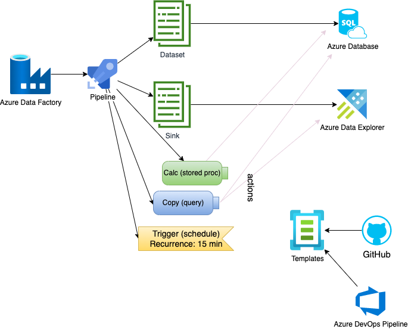
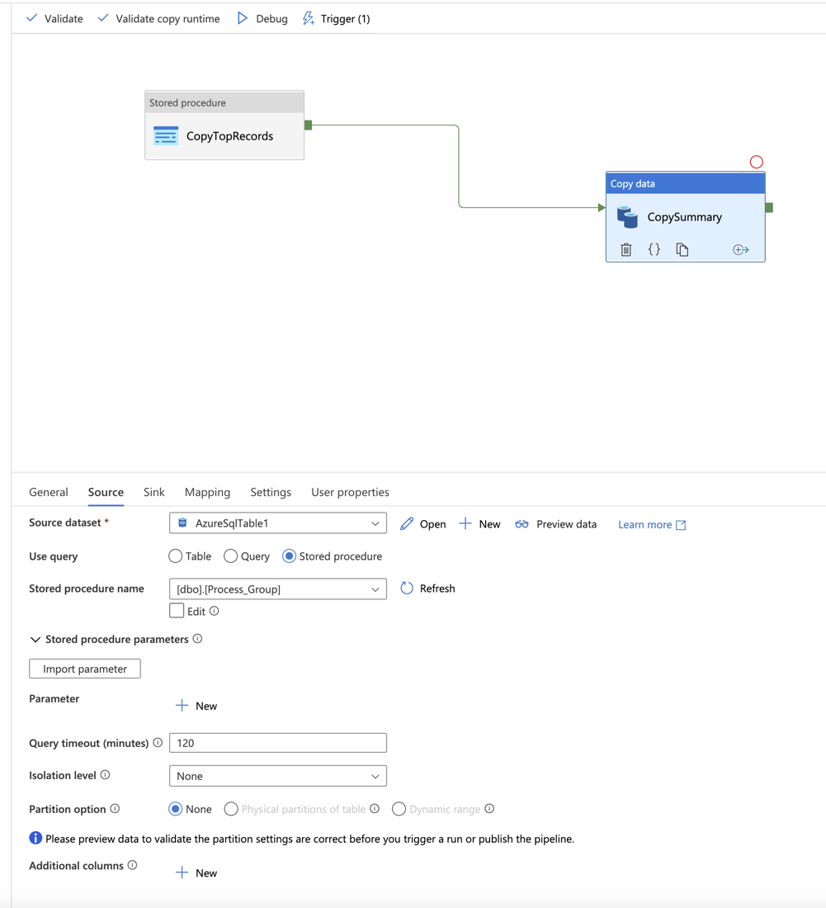
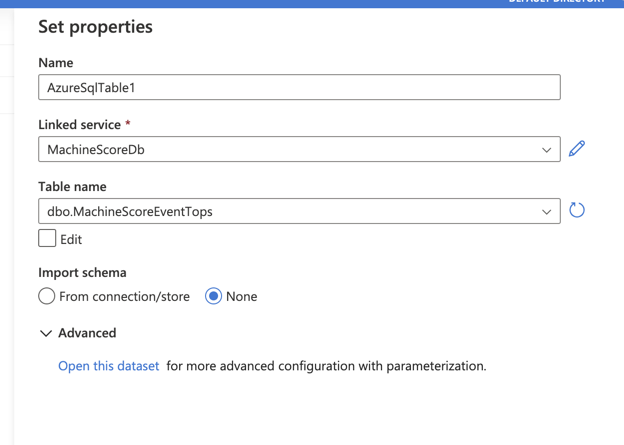
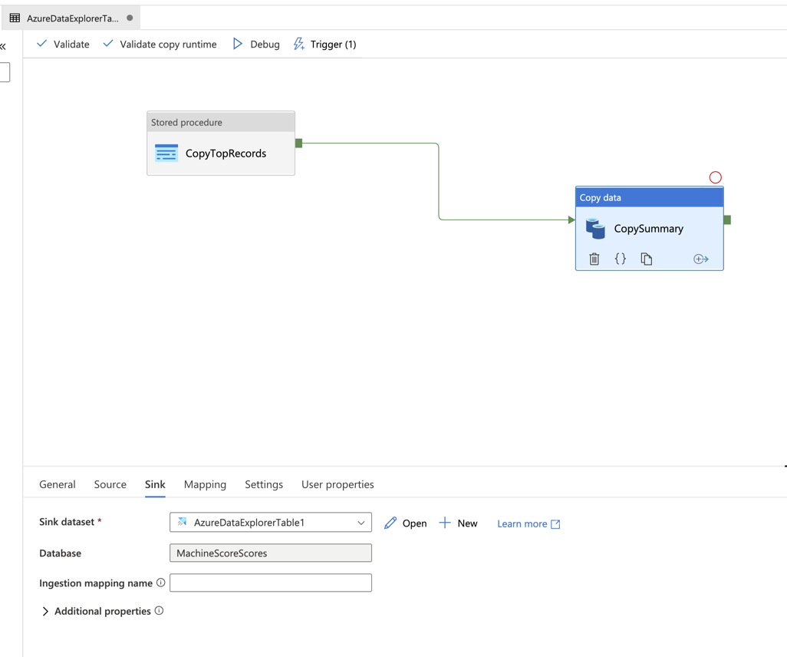

#
## Solution Architecture



## Inital Setup

### Create Resource Group
```az group create -l eastus -n yaron-resource-group```

### Create Database Server

* [database server ARM template](db.server.template.json)

### Create Database

* [data ARM template](db.template.json)

### Create Azure Data Explorer

* [data ARM template](db.template.json)

### Create Tables

* [SQL](./create-table.sql)

```sql
CREATE TABLE MachineScoreEvents
(
	EventId INT IDENTITY(1,1) PRIMARY KEY CLUSTERED, 
	MachineId UNIQUEIDENTIFIER, 
	Score DECIMAL(5,2), 
	MachineGroup SMALLINT, 
	ReportTime DATETIME2(7),
	CONSTRAINT CHK_MachineScoreEvents_Score CHECK (Score>=0 AND Score<=100)
) 

CREATE TABLE MachineScoreEventTops
(
	EventId INT,
	RunNumber INT
)
```

### Fill Table with Demo Data

* [SQL](./fill-events-table.sql)

```SQL 
CREATE OR ALTER PROCEDURE FILL_EVENTS_TBL 
AS
	DECLARE @counter BIGINT, @groupCounter SMALLINT
	SET @groupCounter=0
	SET @counter=0

	DECLARE @maxval DECIMAL(6,5), @minval DECIMAL(6,5)
	SELECT @maxval=1.000,@minval=0.000

	DECLARE @t DATETIME

	WHILE @groupCounter < 100
	BEGIN
		SET @groupCounter = @groupCounter + 1
		SET @counter=0
		WHILE @counter < 10000
		BEGIN
			SET @counter = @counter + 1
			SET @t = (SELECT CAST(CAST(DATEADD(second,0,GETDATE()) AS INT) + CAST(((@maxval) - @minval) * RAND(CHECKSUM(NEWID())) + @minval AS DECIMAL(6,5)) AS DATETIME))
			INSERT INTO "MachineScoreEvents" (MachineId, Score, MachineGroup, ReportTime   ) VALUES (NEWID(), FLOOR(RAND()*(100))+1 ,@groupCounter, @t)
		END
	END
```

### Create Azure Data Explorer Cluster

* [Adx ARM template](./dax.template.json)

### Create Azure Data Explorer Database

```bash
az kusto database create --cluster-name yaronadx --database-name MachineScoreScores --resource-group machine-score-events-db-rg --read-write-database soft-delete-period=P120D hot-cache-period=P7D location=eastus
```

### Create Azure Data Explorer Table

Using ``az kusto script``

```
.create table tops_Job (EventId: int, MachineId: guid, Score: decimal, MachineGroup: int, ReportTime: time, JobRun: time)
```

## Pipeline

### Fill Summary Report with Current Tops Stored Procedure
* [sql](./dist.sql)

```sql
DECLARE @score INT
DECLARE @group NVARCHAR(100)

DECLARE @score1 INT
DECLARE @group1 NVARCHAR(100)

DECLARE @LastRun INT
SET @LastRun = (select Max(RunNumber) from MachineScoreEventTops)
@LastRun + 1 

DECLARE @Max_Scores_By_Groups CURSOR
SET @Max_Scores_By_Groups = CURSOR FOR
    SELECT maxes.score, maxes.MachineGroup
        FROM  (select max(Score) as score, MachineGroup as MachineGroup from MachineScoreEvents group by MachineGroup) maxes
        WHERE (MachineScoreEvents.EventId NOT IN (SELECT EventId from MachineScoreEventTops where MachineScoreEventTops.EventId = MachineScoreEvents.EventId ))

OPEN @Max_Scores_By_Groups
FETCH NEXT FROM @Max_Scores_By_Groups INTO @score, @group
WHILE @@FETCH_STATUS = 0
BEGIN
    INSERT INTO MachineScoreEventTops (Score, MachineGroup, MachineId, ReportTime, RunNumber)
        SELECT Score, MachineGroup, MachineId, ReportTime, @LastRun FROM MachineScoreEvents WHERE (MachineGroup = @group AND Score = @score)
    SET @group1 = null
    FETCH NEXT FROM @Max_Scores_By_Groups INTO @score, @group
END

CLOSE @Max_Scores_By_Groups
DEALLOCATE @Max_Scores_By_Groups

GO
```
### Get Latest Summary Values for DaX Upload

* [sql](./last-run.sql)
```sql

CREATE OR ALTER PROCEDURE Last_run 
AS
    DECLARE @LastRun INT
    SET @LastRun = (select Max(RunNumber) from MachineScoreEventTops)

    select * from MachineScoreEventTops
        INNER JOIN MachineScoreEvents MSE on MachineScoreEventTops.EventId = MSE.EventId
    WHERE MachineScoreEventTops.RunNumber = @LastRun
```

## Data Factory

### Create data factory

```bash
az datafactory create --resource-group machine-score-events-db-rg  --factory-name yaronAdfPipeline
```




## CI/CD


